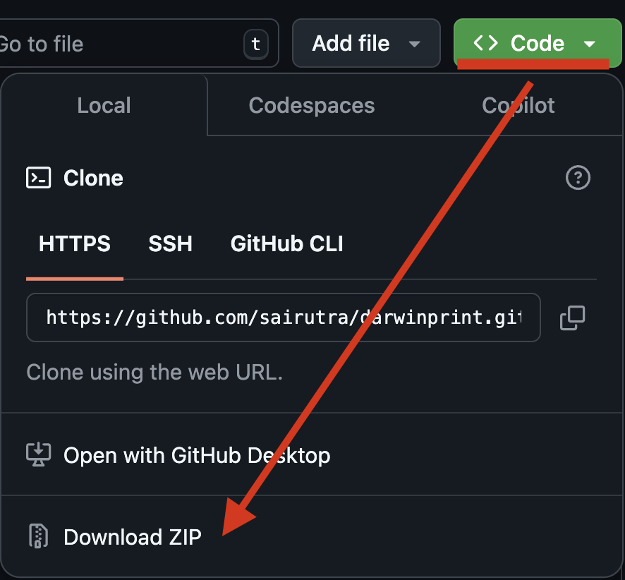
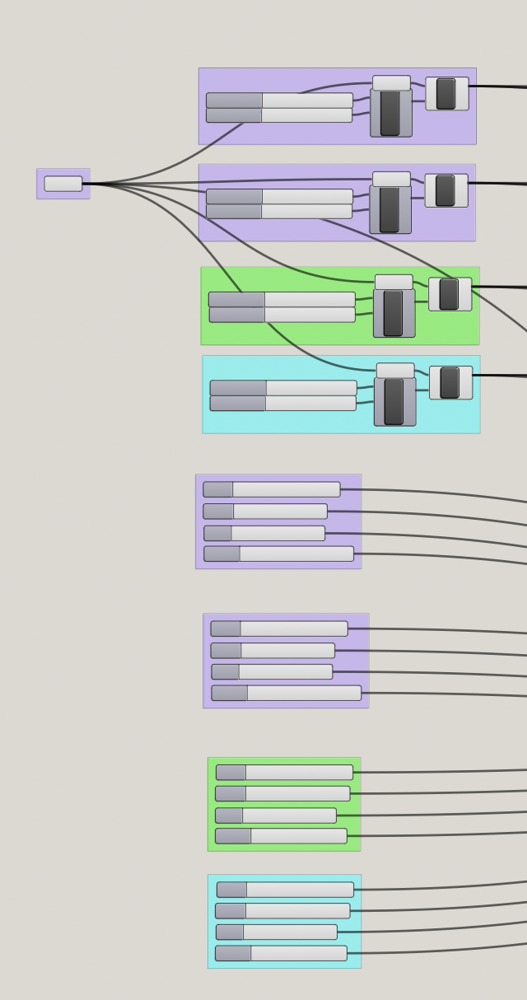
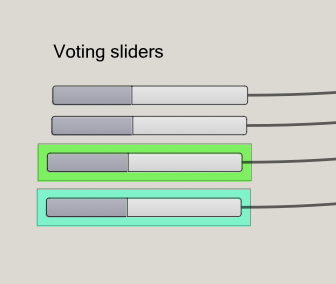
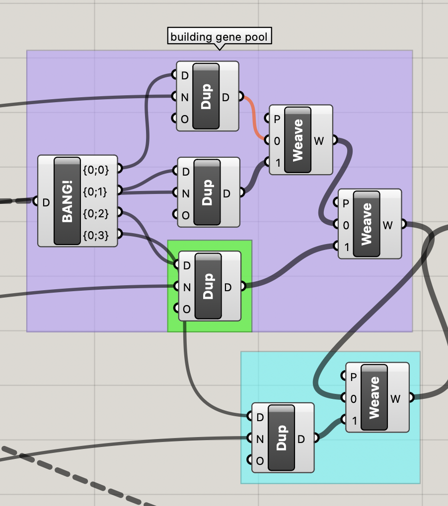
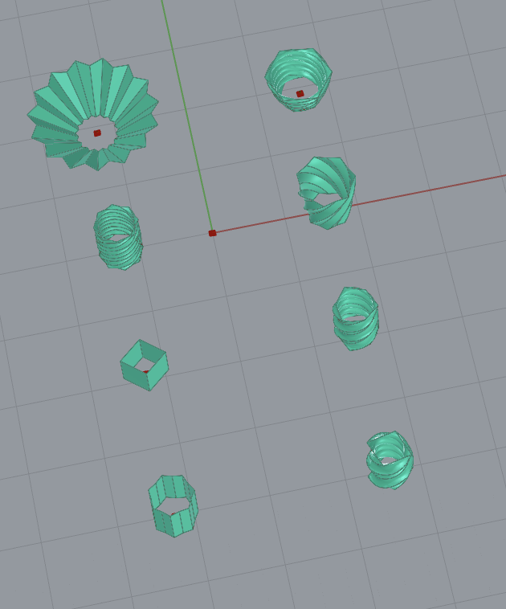
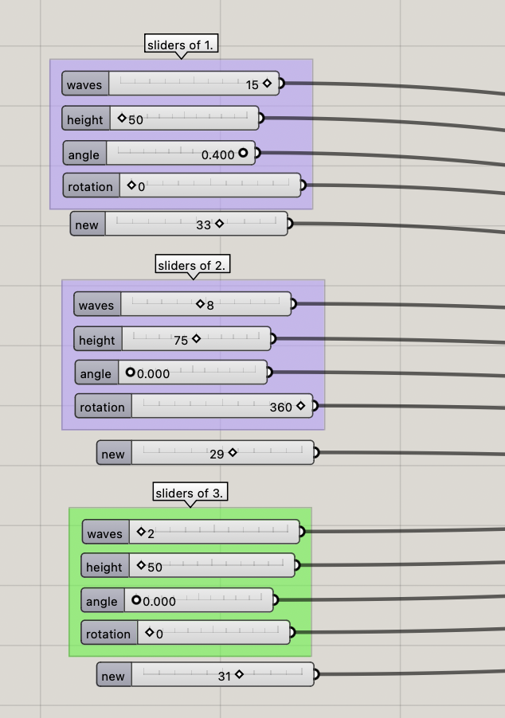
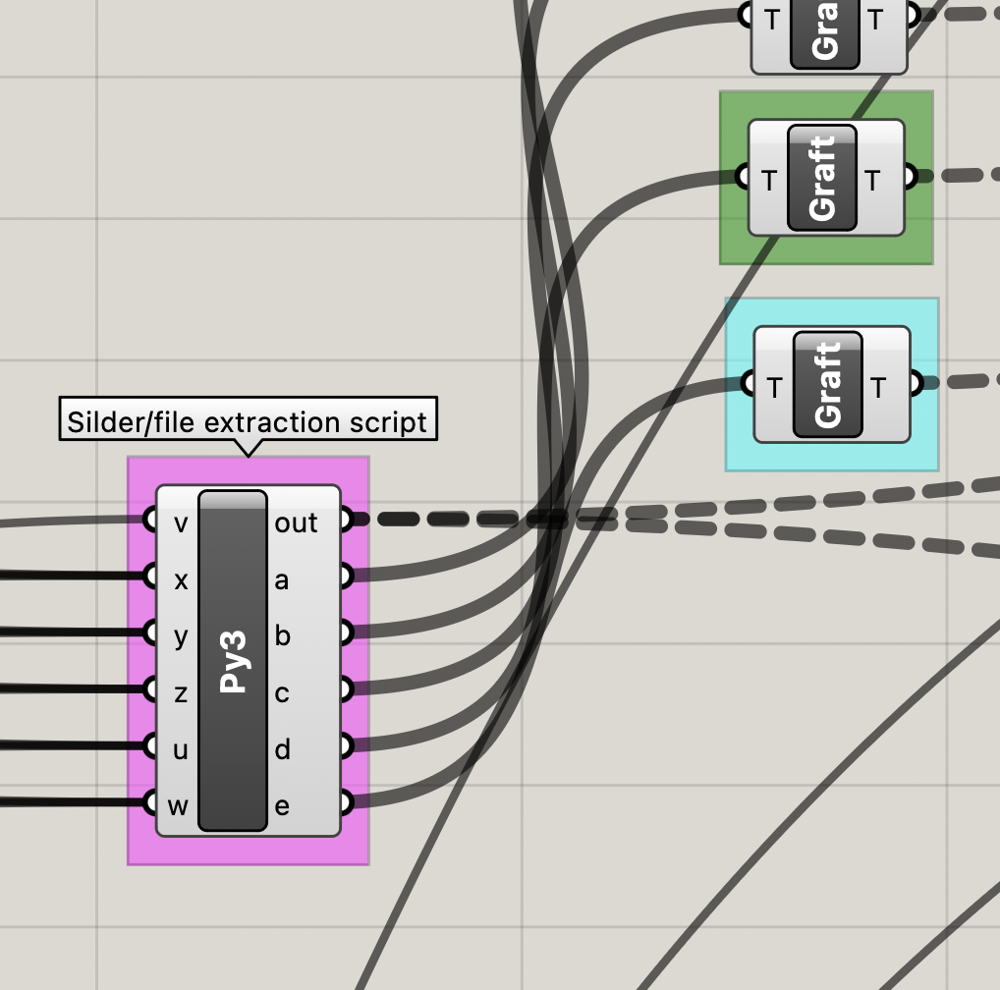
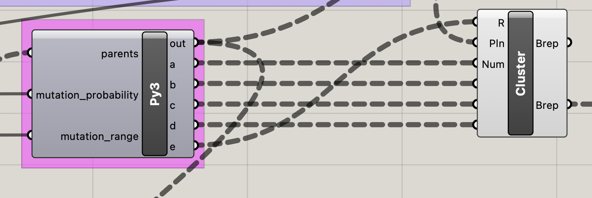
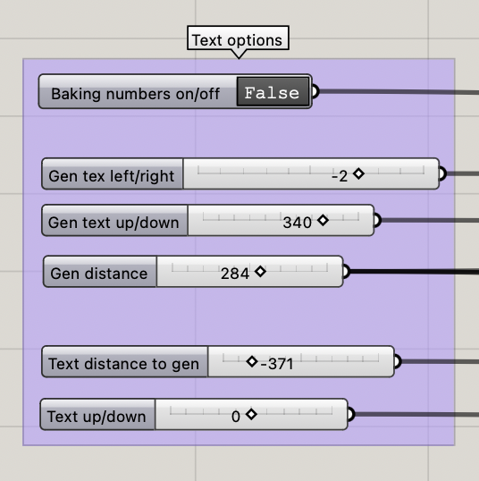

# DARWINproject

## **Explore Evolution in 3D**
DARWINproject is an interactive 3D model designed to bring Darwin’s theory of evolution to life for primary school students. Developed in collaboration with AMS Institute, this project leverages computational design to create an engaging and educational experience.

---

## **Key Features**

#### **🎢 Dynamic 3D Evolution Model**
- Visualizes evolutionary changes dynamically.
- Students can manipulate variables to see the effects of selection and mutation in real time.

#### **🎛️ Interactive Evolution Process**
- Set parent designs and vote on evolutionary progress.
- Real-time feedback on evolving models.
- Supports discussions on natural selection principles.

#### **🖥️ Computationally Designed for Engagement**
- Built with **Rhino**, **Grasshopper**, and **Python**.
- Uses **Rhino-API** to generate realistic evolutionary models.

#### **🔄 Iterative Learning Experience**
- Conduct multiple rounds of evolution (up to 10 generations).
- Experiment with mutation probabilities and genetic variation.
- Hands-on engagement fosters a deeper understanding of Darwinian concepts.

## Tech Stack
- **Rhino**
- **Grasshopper**
- **Rhino-API**
- **Python**

## Development Highlights
- Full software development lifecycle, from requirement gathering to implementation.
- Designed and refined an interactive 3D evolution model based on Darwin’s principles.
- Conducted iterative testing and trials to optimize student engagement and learning outcomes.
- Documented the workflow comprehensively for future research and development.

## Installation
### 1. Clone the repository:
```sh
git clone https://github.com/sairutra/darwinprint.git
```

**OR**

Download as ZIP and unpack:



### 2. Open in Files:
- Open `open_in_rhino/darwinprint.3dm` in Rhino 8.
- Launch Grasshopper and open `open_in_grasshopper/evolution_algorithm.gh` (Loading this file might take a while).

### 3. Activate Rhino Control Panel
In Grasshopper:
- **Mac**: `View > Remote Control Panel`
- **Win**: `???`

In Rhino:
- **Mac**: `Window > Container > Grasshopper`
- **Win**: `???`

## How to Use

1. Set Gen0/Parent Sliders in the three groups: **"Design 1", "Design 2"** and **"Design 3"**.
2. Set all votings to **1**.
3. Set the desired mutation chance and range (mutations can always be changed).
4. Press **"Lock Gen-0"** to bake the first generation.
5. Discuss and vote on **Gen-0 Models**. The evolution process can be followed live and already generates a preview for **Gen-1**.
6. After completing the votes for this step, press **"Bake Generation"** to lock **Gen-1**.
7. Repeat the previous steps until you are satisfied (currently limited to 10 evolutions).


## Q&A
#### Why is the model preview for Gen 0 missing?
- If the model preview of Gen 0 is missing, click **"Reload Evolution"** and **"Delete Evolution"**.

#### How do I change the size of the plane grid?
- **Mac**: `File > Settings > Grid > Grid line count`
- **Win**: `???`
- A value of **3000** should be sufficient.

---

# Administration

## Extend to 4 Models
1. Duplicate **origin plane** from the green group, offset Y position by ~200.
   - Connect plane to the same tools using SHIFT.
2. Duplicate **Gen 0 sliders** from the green group.
   - Connect sliders to the Python cluster using SHIFT.



3. Duplicate **voting slider** from the green group.



4. Extend **"Bang!"** by zooming and clicking **"+"** for more outputs.
5. Duplicate **gene pool generation** from the green group.
   - Connect the new voting slider and extended "Bang!" output to the new "Dup".
6. Add an additional **"Weaver"**.
   - Connect "Dup" output to "Weaver" and "Weaver" output to "Panel".




## Switch the Model or Slider Count
### Prerequisites
- Model origin needs to be based on **one** plane.
- All variables need to be definable by **"Number Sliders"**.
- Model output needs at least **one Preview "Brep" definition**.
- Create a cluster out of the model and define all "Number Sliders" as **Cluster-IN** and the Brep as **Cluster-OUT**.

### Switching
1. **Adjust Slider count and settings**



2. Extend the **"PyScript"** and **"Graft"** for the Model Preview.



3. Switch model **Clusters**:
   - the first Model always has to be renamed to **"Gen0"**
   - Attach correct inputs.
   - Link the preview output the same way as the previous model.
4. Extend or reduce the outputs of the **EvoScript "Py3"** according to the model and link it.



## Changing Position and Text
#### Text options:
Further options to change the position of the text can be found as sliders inside the Grasshopper file:



#### Disable Text
In the **"Dynamic Labels"** group, disable the preview for **"TextSrf"** (grouped in yellow).

---

## **Contributing**
Contributions are welcome! Please follow the standard [GitHub Flow](https://guides.github.com/introduction/flow/) for submitting pull requests. If you find a bug or have a feature request, open an issue in the [issue tracker](https://github.com/sairutra/darwinprint/issues).

## **License**
-   This project uses the MIT license

## **Contact**
For questions or collaboration opportunities, please reach out via [GitHub Issues](https://github.com/sairutra/darwinprint/issues).

